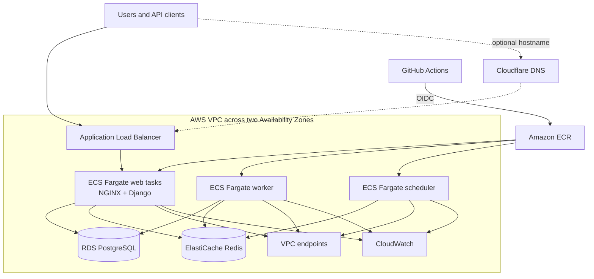

<p align="center"></p>

<h1 align="center">Status-Page on AWS</h1>

<p align="center">A reproducible AWS delivery platform for an open-source status page.</p>

<p align="center">
  <a href="https://github.com/yinon-mitin/Status-Page/actions/workflows/ci.yml"></a>
  <a href="https://github.com/yinon-mitin/Status-Page/blob/main/LICENSE.txt"></a>
  <a href="https://github.com/Status-Page/Status-Page/releases/tag/v2.5.1"></a>
  <a href="README.ru.md"></a>
</p>

## What this project does

This repository turns the archived [Status-Page](https://github.com/Status-Page/Status-Page) application into a complete DevOps project. It runs locally with Docker Compose and can create an isolated AWS environment, publish immutable container images, deploy the application through an approved GitHub Actions release, verify the runtime and database backup, and remove the cloud environment when the demonstration is over.

The full lifecycle was exercised against AWS in `il-central-1`, including a clean Terraform plan after deployment and a destroy that returned the remote state to zero resources.

## Components

| Layer | Components | Role in the project |
| --- | --- | --- |
| Application | Django, Gunicorn, NGINX | Public status page, administration, API and static assets |
| Background work | RQ Worker, RQ Scheduler, Redis | Queued and scheduled application jobs |
| Local runtime | Docker, Docker Compose, PostgreSQL | Complete six-service development environment |
| Containers | Amazon ECR, immutable Git SHA tags | Reproducible application and NGINX images |
| Compute | Amazon ECS Fargate | Web, worker and scheduler workloads without EC2 hosts |
| Data | Amazon RDS PostgreSQL, ElastiCache Redis | Private managed database, cache and queue |
| Network | VPC, public/private subnets, ALB, VPC endpoints | Public entry point with private application and data tiers |
| Delivery | GitHub Actions, OIDC, approval gate | Tested image publication and controlled ECS rollout |
| Operations | Terraform, CloudWatch, lifecycle scripts | Provisioning, monitoring, validation, restore testing and teardown |

## Architecture



ECS tasks and data services stay in private subnets. The public load balancer spans two Availability Zones, while private VPC endpoints provide access to ECR, S3, Secrets Manager and CloudWatch without a permanent NAT Gateway.

## Quick start

Requirements: Docker and Docker Compose.

```bash
cp .env.example .env
make up
make check
```

Open [http://localhost:8081](http://localhost:8081). Stop the stack with `make down`.

## Common commands

| Command | Purpose |
| --- | --- |
| `make up` | Build and start the local stack |
| `make check` | Check HTTP, static assets, Django and the job queue |
| `make test` | Run the application test suite |
| `make docs` | Build the documentation in strict mode |
| `make verify` | Run the complete local quality gate |
| `scripts/production_create.sh` | Create and verify the AWS environment |
| `scripts/production_release.sh` | Run the approved release for an immutable revision |
| `scripts/production_backup_restore_test.sh` | Restore a snapshot and verify database contents |
| `scripts/production_destroy.sh` | Remove the Terraform-managed AWS environment |

Production commands are guarded by exact account, branch, source-tree and Terraform-plan checks. Copy `terraform/environments/prod.tfvars.example` to the ignored private configuration file before using them.

## Reproducibility

The project pins its application baseline, container architecture and GitHub Actions. Terraform plans are saved and validated before apply or destroy. Releases use commit-addressed images, and database migrations run as a separate one-off task before service rollout. The tested teardown keeps only the explicitly bootstrapped recovery resources outside the runtime lifecycle.

## Documentation

| Topic | English | Русский |
| --- | --- | --- |
| Architecture | [Architecture](docs/ARCHITECTURE.md) | [Архитектура](docs/ARCHITECTURE.ru.md) |
| Production lifecycle | [Create, release, restore and destroy](docs/PRODUCTION_LIFECYCLE.md) | [Создание, релиз, восстановление и удаление](docs/PRODUCTION_LIFECYCLE.ru.md) |
| Technology map | [Technology index](docs/TECHNOLOGY_INDEX.md) | [Карта технологий](docs/TECHNOLOGY_INDEX.ru.md) |
| Optional integrations | [External integrations](docs/PRODUCTION_INTEGRATIONS.md) | [Внешние интеграции](docs/PRODUCTION_INTEGRATIONS.ru.md) |
| Verified delivery | [Validation evidence](docs/DELIVERY_EVIDENCE.md) | [Подтверждение реализации](docs/DELIVERY_EVIDENCE.ru.md) |
| Visual overview | [Bilingual architecture overview](docs/PROJECT_INFRASTRUCTURE.html) | English and Russian notes |
| Security reporting | [Security policy](SECURITY.md) | [Политика безопасности](SECURITY.ru.md) |
| Source provenance | [Upstream policy](UPSTREAM.md) | [Политика upstream](UPSTREAM.ru.md) |

## Repository map

```text
.github/workflows/   CI, security scanning and OIDC release workflow
docker/              Container startup and NGINX configuration
docs/                Architecture, lifecycle and operations documentation
infra/               Local VM bootstrap configuration
integrations/        Optional alert relay integration
scripts/             Validation and production lifecycle automation
statuspage/          Pinned Status-Page application source
terraform/           AWS network, data, compute and monitoring resources
```

## Contributors

Project ownership and verified AI assistance are listed in [CONTRIBUTORS.md](CONTRIBUTORS.md).

## License and provenance

The application source is based on Status-Page `v2.5.1` and retains its Apache-2.0 license and upstream history. This repository is an independent educational DevOps implementation; see [UPSTREAM.md](UPSTREAM.md) for the source and maintenance policy.
