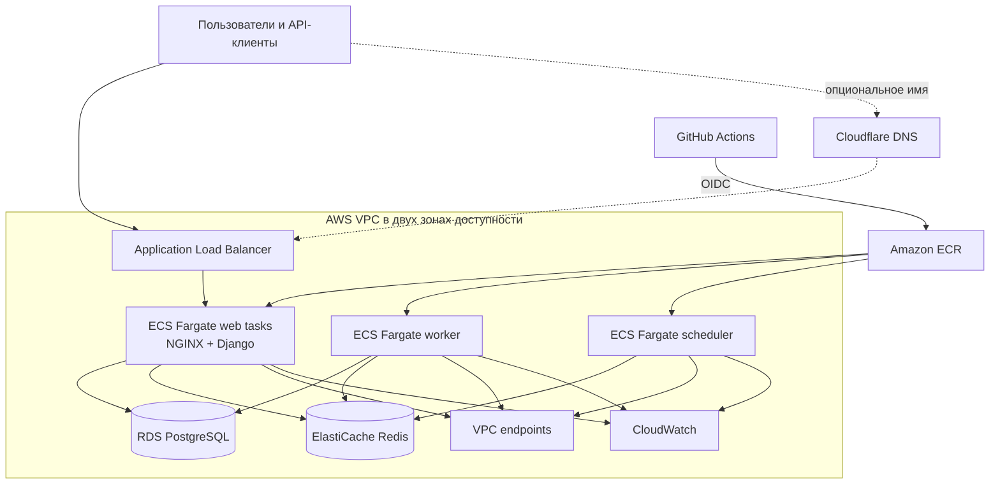

<p align="center"></p>

<h1 align="center">Status-Page в AWS</h1>

<p align="center">Воспроизводимая AWS-платформа для open-source страницы состояния сервисов.</p>

<p align="center">
  <a href="https://github.com/yinon-mitin/Status-Page/actions/workflows/ci.yml"></a>
  <a href="https://github.com/yinon-mitin/Status-Page/blob/main/LICENSE.txt"></a>
  <a href="https://github.com/Status-Page/Status-Page/releases/tag/v2.5.1"></a>
  <a href="README.md"></a>
</p>

## Что делает этот проект

Репозиторий превращает архивированное приложение [Status-Page](https://github.com/Status-Page/Status-Page) в законченный DevOps-проект. Приложение запускается локально через Docker Compose, а автоматизация умеет создать изолированную среду в AWS, опубликовать неизменяемые образы, выполнить контролируемый релиз через GitHub Actions, проверить работу сервисов и резервной копии, а затем удалить облачную среду после демонстрации.

Полный цикл был выполнен в AWS-регионе `il-central-1`: после развёртывания Terraform подтвердил отсутствие расхождений, а автоматическое удаление вернуло удалённое состояние к нулю ресурсов.

## Компоненты проекта

| Уровень | Компоненты | Задача |
| --- | --- | --- |
| Приложение | Django, Gunicorn, NGINX | Публичная status page, панель управления, API и статические файлы |
| Фоновые задачи | RQ Worker, RQ Scheduler, Redis | Очереди и задачи по расписанию |
| Локальная среда | Docker, Docker Compose, PostgreSQL | Полный runtime из шести сервисов для разработки |
| Образы | Amazon ECR, теги по Git SHA | Воспроизводимые образы приложения и NGINX |
| Вычисления | Amazon ECS Fargate | Web, worker и scheduler без управления EC2-серверами |
| Данные | Amazon RDS PostgreSQL, ElastiCache Redis | Приватные управляемые база данных, кэш и очередь |
| Сеть | VPC, public/private subnets, ALB, VPC endpoints | Публичная точка входа и приватные уровни приложения и данных |
| Доставка | GitHub Actions, OIDC, approval gate | Проверенная публикация образов и контролируемый ECS rollout |
| Эксплуатация | Terraform, CloudWatch, lifecycle scripts | Создание, мониторинг, проверка восстановления и удаление среды |

## Архитектура



ECS tasks и хранилища данных находятся в private subnets. Публичный балансировщик работает в двух зонах доступности, а private VPC endpoints дают доступ к ECR, S3, Secrets Manager и CloudWatch без постоянно включённого NAT Gateway.

## Быстрый старт

Требуются Docker и Docker Compose.

```bash
cp .env.example .env
make up
make check
```

Открой [http://localhost:8081](http://localhost:8081). Для остановки используй `make down`.

## Основные команды

| Команда | Назначение |
| --- | --- |
| `make up` | Собрать и запустить локальную среду |
| `make check` | Проверить HTTP, статические файлы, Django и очередь задач |
| `make test` | Запустить тесты приложения |
| `make docs` | Собрать документацию в строгом режиме |
| `make verify` | Выполнить полный локальный quality gate |
| `scripts/production_create.sh` | Создать и проверить среду в AWS |
| `scripts/production_release.sh` | Выполнить подтверждённый релиз выбранной revision |
| `scripts/production_backup_restore_test.sh` | Восстановить snapshot и проверить данные |
| `scripts/production_destroy.sh` | Удалить управляемую Terraform среду AWS |

Production-команды проверяют точный AWS account, ветку, исходное дерево и Terraform plan. Перед запуском скопируй `terraform/environments/prod.tfvars.example` в приватный файл, который исключён из Git.

## Воспроизводимость

В проекте закреплены версия исходного приложения, архитектура контейнеров и версии GitHub Actions. Terraform сохраняет и проверяет планы перед созданием или удалением ресурсов. Релизы используют образы с адресацией по commit SHA, а миграции базы выполняются отдельной задачей перед обновлением сервисов. Проверенный teardown сохраняет вне runtime только заранее подготовленные recovery-ресурсы.

## Документация

| Тема | English | Русский |
| --- | --- | --- |
| Архитектура | [Architecture](docs/ARCHITECTURE.md) | [Архитектура](docs/ARCHITECTURE.ru.md) |
| Production lifecycle | [Create, release, restore and destroy](docs/PRODUCTION_LIFECYCLE.md) | [Создание, релиз, восстановление и удаление](docs/PRODUCTION_LIFECYCLE.ru.md) |
| Карта технологий | [Technology index](docs/TECHNOLOGY_INDEX.md) | [Карта технологий](docs/TECHNOLOGY_INDEX.ru.md) |
| Опциональные интеграции | [External integrations](docs/PRODUCTION_INTEGRATIONS.md) | [Внешние интеграции](docs/PRODUCTION_INTEGRATIONS.ru.md) |
| Проверенная реализация | [Validation evidence](docs/DELIVERY_EVIDENCE.md) | [Подтверждение реализации](docs/DELIVERY_EVIDENCE.ru.md) |
| Визуальная схема | [Двуязычный architecture overview](docs/PROJECT_INFRASTRUCTURE.html) | English и русские пояснения |
| Security reports | [Security policy](SECURITY.md) | [Политика безопасности](SECURITY.ru.md) |
| Происхождение исходников | [Upstream policy](UPSTREAM.md) | [Политика upstream](UPSTREAM.ru.md) |

## Структура репозитория

```text
.github/workflows/   CI, security scanning и OIDC release workflow
docker/              Запуск контейнеров и конфигурация NGINX
docs/                Архитектура, lifecycle и эксплуатационная документация
infra/               Bootstrap локальной виртуальной машины
integrations/        Опциональная интеграция доставки алертов
scripts/             Проверки и автоматизация production lifecycle
statuspage/          Закреплённый исходный код Status-Page
terraform/           Сеть, данные, вычисления и мониторинг в AWS
```

## Участники

Автор проекта и подтверждённая AI assistance перечислены в [CONTRIBUTORS.ru.md](CONTRIBUTORS.ru.md).

## Лицензия и происхождение

Исходный код приложения основан на Status-Page `v2.5.1` и сохраняет лицензию Apache-2.0 и upstream history. Этот репозиторий является самостоятельной учебной DevOps-реализацией; подробности находятся в [UPSTREAM.ru.md](UPSTREAM.ru.md).
