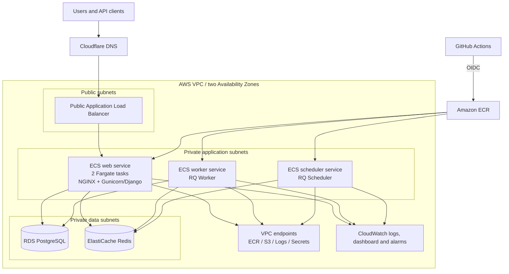
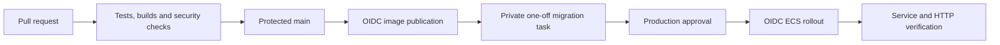

# Architecture

[Русская версия](ARCHITECTURE.ru.md)

## Purpose

This project packages Status-Page as a reproducible local and AWS workload. The application keeps its original Django, RQ, PostgreSQL and Redis model while the surrounding platform adds immutable containers, private networking, managed data services, controlled releases, monitoring and a tested recovery path.

## Runtime view



## Application roles

| Role | Process | Responsibility |
| --- | --- | --- |
| Web | NGINX and Gunicorn/Django | Public pages, administration, REST API and static assets |
| Worker | `manage.py rqworker high default low` | Asynchronous jobs from Redis queues |
| Scheduler | `manage.py rqscheduler` | Periodic job scheduling |
| Database | PostgreSQL | Application system of record |
| Queue and cache | Redis | RQ broker and Django cache |

The application image is shared by web, worker and scheduler. A separate NGINX image contains the compiled frontend and static files, so the production web task does not depend on a shared container volume.

## AWS components

| Component | Implementation |
| --- | --- |
| Network | One VPC across `il-central-1a` and `il-central-1b`, with public, application and data subnets |
| Ingress | Internet-facing ALB in both public subnets, forwarding to IP targets in the web service |
| Compute | ECS Fargate services: two web tasks, one worker and one scheduler |
| Images | Two private ECR repositories with immutable Git SHA tags and lifecycle policies |
| Database | Encrypted private RDS PostgreSQL with automated backups and final snapshots |
| Queue/cache | Encrypted private ElastiCache Redis replication group |
| Secrets | Secrets Manager references injected into ECS tasks at runtime |
| Egress | Interface endpoints for ECR, CloudWatch Logs and Secrets Manager; S3 gateway endpoint |
| Monitoring | CloudWatch log groups, dashboard and 18 workload alarms |
| State | Encrypted and versioned S3 Terraform backend with native lockfiles |

NAT Gateway is disabled in the baseline. The application reaches required AWS APIs through VPC endpoints, which reduces recurring cost and keeps ECS tasks without public IP addresses.

## Network policy

```text
Internet            -> ALB security group       : HTTP ingress
ALB security group  -> ECS security group       : TCP 80
ECS security group  -> RDS security group       : TCP 5432
ECS security group  -> Redis security group     : TCP 6379
ECS security group  -> endpoint security group  : TCP 443
```

RDS and Redis have no public route or public endpoint. Security groups reference one another instead of opening database ports to CIDR ranges.

## Delivery model



GitHub uses separate OIDC roles for publishing images and updating ECS services. Releases use immutable `sha-<commit>` tags. Database migrations run in a private one-off Fargate task and must succeed for the exact revision before deployment can continue. The web service stabilizes before worker and scheduler rollout.

## Infrastructure lifecycle

Terraform owns the VPC, subnets, security groups, VPC endpoints, ECR repositories, ECS cluster and services, ALB, RDS, Redis, log groups, dashboard and alarms. Guarded scripts provide the operator interface:

```text
production_create.sh
  -> production_release.sh
  -> production_backup_restore_test.sh
  -> production_destroy.sh
```

Every mutating path verifies the account, exact `origin/main` revision, clean source tree, explicit private variables and saved Terraform plan. Plans use a resource and action allowlist before apply.

## Recovery model

The restore rehearsal writes a unique probe to PostgreSQL, creates a snapshot, restores a temporary private database, verifies the probe and Django migration history from a Fargate task, and removes all temporary resources. Runtime destroy creates an encrypted final RDS snapshot and preserves the remote-state and bootstrap resources required for another demonstration.

## Design choices

- ECS Fargate avoids maintaining EC2 hosts for a small workload.
- Two web tasks and a two-AZ ALB demonstrate application-tier availability.
- One scheduler prevents duplicate periodic jobs.
- Immutable image tags bind deployments to source revisions.
- Private data and application subnets keep the public surface limited to the load balancer.
- VPC endpoints replace a permanent NAT Gateway for the required AWS services.
- Terraform and release automation have separate ownership: Terraform manages service structure, while the release workflow manages deployed task-definition revisions.

## Related documentation

- [Production lifecycle](PRODUCTION_LIFECYCLE.md)
- [Technology index](TECHNOLOGY_INDEX.md)
- [Validation evidence](DELIVERY_EVIDENCE.md)
- [HTTPS scope](HTTPS_LIMITATION.md)
- [Upstream provenance](https://github.com/yinon-mitin/Status-Page/blob/main/UPSTREAM.md)
