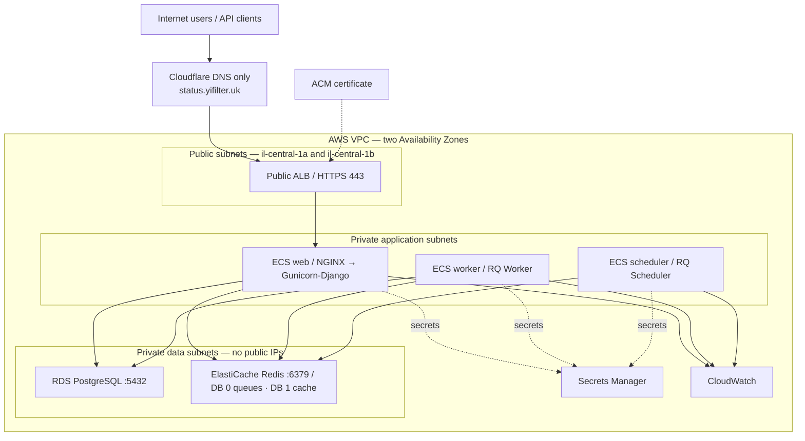

# Yinon Final Project — Status-Page AWS Architecture

**Status:** approved production direction; local Docker milestone complete · **Language:** English · **Date:** 26 August 2026

## Evidence boundary

- **Source-derived:** verified against the pinned official upstream release `v2.5.1` at the repository root; `reference/ARCHITECTURE.source.html` remains historical reference material.
- **Target decision:** proposed AWS design, to be validated in the AWS account before production use.

## Project overview

Status-Page is a Django modular monolith for public status, incidents, administration, and a REST API. The source runtime uses NGINX → Gunicorn/Django, PostgreSQL, Redis, RQ Worker, and RQ Scheduler.

**Pinned source:** official `Status-Page/Status-Page` release `v2.5.1` (29 October 2024), validated locally as Status-Page 2.5.1. The upstream project is archived and no longer receives security support; this is a documented project constraint.

The target is Docker + ECR + ECS Fargate + ALB/ACM + RDS PostgreSQL + ElastiCache Redis + Secrets Manager + IAM + CloudWatch + Terraform + GitHub Actions. NGINX remains in the web task.

## Current application — source-derived facts

- Django 5.1.2 on Python ≥ 3.10; Gunicorn serves `statuspage.wsgi` on `0.0.0.0:8001` inside the web container.
- NGINX redirects HTTP to HTTPS, serves `/static/` from disk, and proxies dynamic requests to Gunicorn.
- PostgreSQL is the single system of record.
- Redis DB 0 is the RQ broker (`high`, `default`, `low`); Redis DB 1 is Django cache.
- Separate processes run `manage.py rqworker high default low` and `manage.py rqscheduler`.
- `MEDIA_ROOT` is local disk and plugin sync work is not guaranteed concurrency-safe.
- Upstream Status-Page supports optional SMTP notifications.

## Target AWS architecture



The source three-process runtime is preserved. AWS services and delivery tooling are target decisions. The ALB spans public subnets in `il-central-1a` and `il-central-1b`; the web service runs two tasks spread across the corresponding internal application subnets. Worker and scheduler start with one task each. RDS and Redis remain private.

## Decisions and components

| Area | Decision | Purpose / rationale |
|---|---|---|
| Docker + ECR | One image, Git-SHA tag | Reproducible web, worker, and scheduler commands from the same image. |
| ECS Fargate | Three ECS workloads | Managed containers without EC2 administration; two web tasks across two internal subnets, plus one worker and one scheduler task initially. |
| ALB + ACM + Cloudflare DNS | Internet-facing ALB in two public subnets | `status.yifilter.uk` is DNS-only in Cloudflare; ACM validates and terminates HTTPS on the ALB. HTTP redirects to HTTPS and `/healthz` checks use IP targets. |
| NGINX | In the web task | Keeps source `/static/` and Gunicorn reverse-proxy contract. |
| RDS PostgreSQL | Private managed database | `publicly_accessible = false`; its SG allows port 5432 only from the ECS SG. Automated backups are retained for two days. |
| ElastiCache Redis | Private managed Redis | Preserves source cache/queue split; port 6379 only from ECS. |
| Secrets Manager + IAM | Runtime credentials / least privilege | Store `SECRET_KEY`, database and Redis credentials, and approved external API keys only. |
| CloudWatch | Logs, metrics, alarms | Service health, restarts, capacity, RDS, and Redis visibility. |
| VPC endpoints | Private AWS-service egress | ECR API/Docker, CloudWatch Logs, Secrets Manager, and S3 are reachable from ECS without NAT or public task IPs. |
| NAT Gateway | Optional, disabled by default | Retained as a Terraform option only if application features must call arbitrary external HTTPS services; it is not a permanent baseline because of budget. |
| Terraform | Infrastructure as Code | Version-controlled VPC, subnets, SGs, services, data tier, logging, and outputs. |
| GitHub Actions + OIDC | CI/CD | Tests and deploys with short-lived AWS credentials. |
| EKS | Not selected | Kubernetes operational overhead is unnecessary for this small workload. |

**Worker and scheduler:** the worker runs `rqworker` for internal asynchronous work. The scheduler runs one `rqscheduler` task to avoid duplicate periodic jobs.

## Network and security model

- VPC `/16` uses `il-central-1a` and `il-central-1b`; `il-central-1c` is confirmed available and reserved for future expansion. The internet-facing ALB uses public subnets in both active AZs. ECS tasks stay in internal application subnets with no public IPs; two web tasks are spread across them. RDS and ElastiCache stay private.
- The ALB target group uses HTTP port 80, target type `ip`, cross-zone load balancing, and `/healthz` with matcher `200`, 15-second interval, healthy threshold 2, and unhealthy threshold 3.
- Security groups allow Internet → ALB (80/443), ALB SG → ECS web SG (80), ECS SG → RDS SG (5432), and ECS SG → Redis SG (6379).
- RDS has `publicly_accessible = false` and a private DB subnet group. Redis has no public endpoint. Data services accept traffic only from the ECS SG.
- ECS reaches required AWS services through interface endpoints for ECR API, ECR Docker, CloudWatch Logs, and Secrets Manager plus an S3 gateway endpoint. Endpoint SGs allow HTTPS only from the ECS SG. No NAT Gateway is enabled in the cost-conscious baseline.
- Use ACM TLS, RDS encryption and backups, compatible Redis TLS/authentication, IAM least privilege, GitHub OIDC, MFA for humans, and Secrets Manager.
- Preserve Django proxy/security settings, CSRF, secure cookies, and source OTP/TOTP protections.

## CI/CD

**Application:** tests + RQ smoke test + secret scan + Terraform static checks → Docker build → GitHub OIDC → ECR SHA image → ECS task definition → automatic rolling deployment from protected `main` → ECS/ALB health verification.

**Infrastructure:** `terraform fmt -check` → `terraform init` → `terraform validate` → static/security checks → reviewed plan → protected approved apply.

Rollback redeploys the prior known-good SHA. Run database migrations as a controlled ECS one-off task.

## Terraform layout

```text
terraform/
├── versions.tf  providers.tf  backend.tf  variables.tf  outputs.tf
├── environments/{dev,prod}/
└── modules/{network,security-groups,ecr,alb,ecs,rds,redis,iam,secrets,monitoring}/
```

The current single-operator baseline keeps local state while infrastructure is being prepared. Before Terraform `apply` runs from GitHub Actions, migrate state to an encrypted, versioned S3 backend with native S3 lockfiles (`use_lockfile = true`); DynamoDB locking is deliberately not used. Secrets must not be placed in `*.tfvars`.

## Constraints and roadmap

- **Completed Wednesday milestone:** Docker images and Docker Compose run web, worker, scheduler, PostgreSQL, Redis, NGINX, migrations, static files, `/healthz`, and an executed RQ smoke job locally.
- Start with two web tasks in two AZs to demonstrate compute availability; worker and scheduler remain one task each until media is durable (S3/EFS or a formal restriction) and worker jobs are idempotent/locked.
- Redis is on the request critical path; test recovery. The cost ceiling is $300; create budget alerts before applying persistent resources. If the application must call arbitrary public endpoints, enable the optional NAT path only for the necessary demonstration period.

| Phase | Milestone | Acceptance criteria |
|---|---|---|
| 0 | Decisions | Scope and risk register are recorded. |
| 1 | Local runtime — complete | Complete Docker Compose stack works and returns HTTP 200 through NGINX. |
| 2 | Container — complete | One application image starts three roles; a separate NGINX image fronts web; no production secrets are in either image. |
| 3 | Foundation | Terraform creates network, SGs, VPC endpoints, tags, and budget controls. |
| 4 | Data | Private RDS (two-day backups) and private Redis pass migration, cache, and queue tests. |
| 5 | ECS/ingress | Stable tasks, ALB/ACM HTTPS, and health checks work. |
| 6 | CI/CD | OIDC, reviewed deploy, logs, alarms, and rollback are tested. |
| 7 | Validation | Implementation matches the architecture and is reproducible. |

## References

- `reference/ARCHITECTURE.source.html` — authoritative current architecture reference.
- repository root — pinned official upstream source release v2.5.1.
- `TECHNOLOGY_INDEX.md` — English technology index.
- `TECHNOLOGY_INDEX.ru.md` — Russian technology index.
