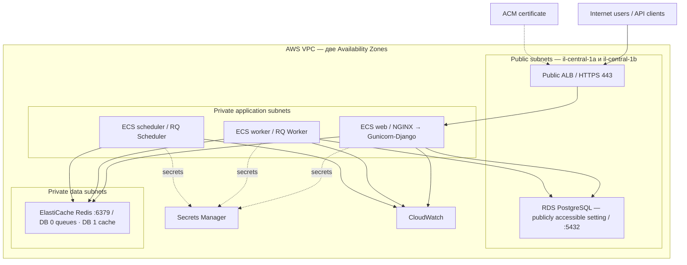

# Финальный проект Yinon — AWS-архитектура Status-Page

**Статус:** согласованное направление; локальный Docker milestone завершён · **Язык:** русский · **Дата:** 24 августа 2026

## Граница между фактами и решениями

- **Факт из исходника:** проверен по закреплённому official upstream release `v2.5.1` в корне репозитория; `reference/ARCHITECTURE.source.html` остаётся historical reference material.
- **Целевое решение:** предложенный AWS design, который нужно проверить в AWS account перед production use.

## Обзор проекта

Status-Page — модульный монолит Django для публичного статуса, инцидентов, administration и REST API. Source runtime использует NGINX → Gunicorn/Django, PostgreSQL, Redis, RQ Worker и RQ Scheduler.

**Закреплённый source:** официальный release `Status-Page/Status-Page` `v2.5.1` от 29 октября 2024, локально проверенный как Status-Page 2.5.1. Upstream project архивирован и больше не получает security support; это зафиксированное ограничение проекта.

Целевой deployment: Docker + ECR + ECS Fargate + ALB/ACM + RDS PostgreSQL + ElastiCache Redis + Secrets Manager + IAM + CloudWatch + Terraform + GitHub Actions. NGINX остаётся в web task.

## Текущее приложение — факты из исходника

- Django 5.1.2 на Python ≥ 3.10; Gunicorn обслуживает `statuspage.wsgi` на `0.0.0.0:8001` внутри web container.
- NGINX перенаправляет HTTP на HTTPS, отдаёт `/static/` с диска и проксирует dynamic requests к Gunicorn.
- PostgreSQL — единственный system of record.
- Redis DB 0 — RQ broker (`high`, `default`, `low`); Redis DB 1 — Django cache.
- Отдельные процессы запускают `manage.py rqworker high default low` и `manage.py rqscheduler`.
- `MEDIA_ROOT` — local disk, а plugin sync work может быть unsafe при concurrency.
- Upstream Status-Page поддерживает optional SMTP notifications.

## Целевая AWS-архитектура



Модель из трёх source runtime processes сохранена. AWS services и delivery tooling являются target decisions. Первые ECS targets размещаются в `il-central-1a`, но ALB подключён к public subnets в `il-central-1a` и `il-central-1b`. Cross-zone load balancing остаётся включённым, поэтому ALB node из любой AZ может направить запрос к targets в AZ A.

## Решения и компоненты

| Область | Решение | Назначение / обоснование |
|---|---|---|
| Docker + ECR | Один image, Git-SHA tag | Reproducible web, worker и scheduler commands из одного image. |
| ECS Fargate | Три ECS workloads | Managed containers без EC2 administration; сначала по одной web, worker и scheduler task. |
| ALB + ACM | Internet-facing ALB в двух public subnets | HTTPS, HTTP redirect, certificate lifecycle и проверки `/healthz`. Target type — `ip`; cross-zone routing явно включён. |
| NGINX | Внутри web task | Сохраняет source `/static/` и Gunicorn reverse-proxy contract. |
| RDS PostgreSQL | Publicly accessible managed database | Соответствует согласованной с ментором topology; RDS SG разрешает port 5432 только от ECS SG, без Internet CIDR rule. |
| ElastiCache Redis | Private managed Redis | Сохраняет source cache/queue split; port 6379 только от ECS. |
| Secrets Manager + IAM | Runtime credentials / least privilege | Хранит `SECRET_KEY`, database и Redis credentials, а также только approved external API keys. |
| CloudWatch | Logs, metrics, alarms | Наблюдаемость service health, restarts, capacity, RDS и Redis. |
| Terraform | Infrastructure as Code | Version-controlled VPC, subnets, SGs, services, data tier, logging и outputs. |
| GitHub Actions + OIDC | CI/CD | Tests и deploy с short-lived AWS credentials. |
| EKS | Не выбран | Kubernetes operational overhead излишен для данного workload. |

**Worker и scheduler:** worker запускает `rqworker` для internal asynchronous work. Scheduler запускает одну `rqscheduler` task, чтобы избежать duplicate periodic jobs.

## Network и security model

- VPC `/16` в двух AZ. Internet-facing ALB использует public subnets в обеих AZ. ECS tasks остаются во внутренних application subnets; начальные tasks запускаются только в `il-central-1a`. ElastiCache остаётся private.
- ALB target group использует HTTP port 80, target type `ip`, cross-zone load balancing и `/healthz`: matcher `200`, interval 15 секунд, healthy threshold 2, unhealthy threshold 3.
- Security groups разрешают Internet → ALB (80/443), ALB SG → ECS web SG (80), ECS SG → RDS SG (5432) и ECS SG → Redis SG (6379).
- RDS имеет setting publicly accessible и подходящий DB subnet group, но его SG не содержит public CIDR ingress: database access разрешён только от источника с ECS SG. У Redis нет public endpoint. Worker egress ограничен approved HTTPS integrations.
- Использовать ACM TLS, RDS encryption и backups, compatible Redis TLS/authentication, IAM least privilege, GitHub OIDC, MFA и Secrets Manager.
- Сохранить Django proxy/security settings, CSRF, secure cookies и source OTP/TOTP protections.

## CI/CD

**Application:** test → Docker build → smoke test → GitHub OIDC → ECR SHA image → ECS task definition → rolling deployment → ECS/ALB health verification.

**Infrastructure:** `terraform fmt -check` → `terraform init` → `terraform validate` → static/security checks → reviewed plan → protected approved apply.

Rollback повторно разворачивает previous known-good SHA. Database migrations запускаются как controlled ECS one-off task.

## Terraform layout

```text
terraform/
├── versions.tf  providers.tf  backend.tf  variables.tf  outputs.tf
├── environments/{dev,prod}/
└── modules/{network,security-groups,ecr,alb,ecs,rds,redis,iam,secrets,monitoring}/
```

Использовать remote state и locking. Secrets нельзя помещать в `*.tfvars`.

## Ограничения и roadmap

- **Milestone на среду завершён:** Docker images и Docker Compose локально запускают web, worker, scheduler, PostgreSQL, Redis, NGINX, migrations, static files, `/healthz` и выполненный RQ smoke job.
- Начать с одной task на runtime role. Scaling только после durable media (S3/EFS или formal restriction) и idempotent/locked worker jobs.
- Redis находится на request critical path; проверить recovery. Подтвердить AWS region, domain, budget, retention, RPO/RTO и approved external HTTPS integrations.

| Этап | Milestone | Acceptance criteria |
|---|---|---|
| 0 | Decisions | Scope и risk register записаны. |
| 1 | Local runtime — завершён | Complete Docker Compose stack работает и возвращает HTTP 200 через NGINX. |
| 2 | Container — завершён | Один application image запускает три роли; отдельный NGINX image обслуживает web; production secrets отсутствуют в images. |
| 3 | Foundation | Terraform создаёт network, SGs, state и tags. |
| 4 | Data | Publicly accessible RDS с доступом только от ECS SG и private Redis проходят migration, cache и queue tests. |
| 5 | ECS/ingress | Stable tasks, ALB/ACM HTTPS и health checks работают. |
| 6 | CI/CD | OIDC, reviewed deploy, logs, alarms и rollback протестированы. |
| 7 | Validation | Implementation соответствует architecture и воспроизводим. |

## Источники

- `reference/ARCHITECTURE.source.html` — authoritative current architecture reference.
- корень репозитория — закреплённый официальный upstream source release v2.5.1.
- `TECHNOLOGY_INDEX.md` — English technology index.
- `TECHNOLOGY_INDEX.ru.md` — Russian technology index.
