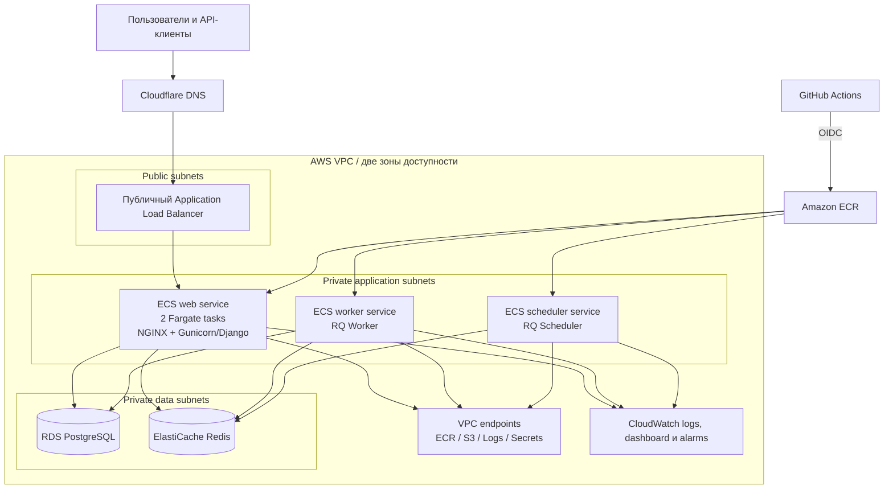
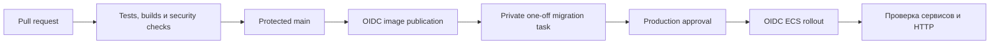

# Архитектура

[English version](ARCHITECTURE.md)

## Назначение

Проект упаковывает Status-Page в воспроизводимую локальную и AWS-среду. Приложение сохраняет исходную модель Django, RQ, PostgreSQL и Redis, а платформа добавляет неизменяемые контейнеры, приватную сеть, управляемые хранилища данных, контролируемые релизы, мониторинг и проверенный сценарий восстановления.

## Runtime



## Роли приложения

| Роль | Процесс | Задача |
| --- | --- | --- |
| Web | NGINX и Gunicorn/Django | Публичные страницы, панель управления, REST API и статические файлы |
| Worker | `manage.py rqworker high default low` | Асинхронные задачи из очередей Redis |
| Scheduler | `manage.py rqscheduler` | Запуск периодических задач |
| Database | PostgreSQL | Основное хранилище приложения |
| Queue and cache | Redis | RQ broker и Django cache |

Web, worker и scheduler используют общий application image. Отдельный NGINX image содержит собранный frontend и static files, поэтому production web task не зависит от общего container volume.

## Компоненты AWS

| Компонент | Реализация |
| --- | --- |
| Сеть | Одна VPC в `il-central-1a` и `il-central-1b`, с public, application и data subnets |
| Входящий трафик | Internet-facing ALB в двух public subnets, IP targets ведут к web service |
| Вычисления | ECS Fargate services: две web tasks, один worker и один scheduler |
| Образы | Два private ECR repositories с неизменяемыми Git SHA tags и lifecycle policies |
| База данных | Encrypted private RDS PostgreSQL с automated backups и final snapshots |
| Очередь и кэш | Encrypted private ElastiCache Redis replication group |
| Секреты | Ссылки Secrets Manager передаются ECS tasks во время запуска |
| Исходящий доступ | Interface endpoints для ECR, CloudWatch Logs и Secrets Manager; S3 gateway endpoint |
| Мониторинг | CloudWatch log groups, dashboard и 18 alarms |
| Terraform state | Encrypted versioned S3 backend с native lockfiles |

NAT Gateway по умолчанию выключен. Для обязательных AWS API используются VPC endpoints, поэтому ECS tasks не получают public IP, а среда не несёт постоянных расходов на NAT.

## Сетевые правила

```text
Internet            -> ALB security group       : HTTP ingress
ALB security group  -> ECS security group       : TCP 80
ECS security group  -> RDS security group       : TCP 5432
ECS security group  -> Redis security group     : TCP 6379
ECS security group  -> endpoint security group  : TCP 443
```

RDS и Redis не имеют публичного маршрута или публичной точки доступа. Security groups ссылаются друг на друга, вместо открытия database ports для широких CIDR ranges.

## Модель доставки



GitHub использует отдельные OIDC roles для публикации образов и обновления ECS services. Релизы используют immutable tags `sha-<commit>`. Миграции базы выполняются private one-off Fargate task и должны успешно завершиться для точной revision до начала deployment. Web service стабилизируется раньше worker и scheduler.

## Жизненный цикл инфраструктуры

Terraform управляет VPC, subnets, security groups, VPC endpoints, ECR repositories, ECS cluster и services, ALB, RDS, Redis, log groups, dashboard и alarms. Основной интерфейс оператора состоит из четырёх scripts:

```text
production_create.sh
  -> production_release.sh
  -> production_backup_restore_test.sh
  -> production_destroy.sh
```

Перед изменениями проверяются AWS account, точная revision `origin/main`, чистота source tree, явный private variables file и сохранённый Terraform plan. План проходит allowlist ресурсов и действий до apply.

## Восстановление

Restore rehearsal записывает уникальный probe в PostgreSQL, создаёт snapshot, восстанавливает временную private database, проверяет probe и Django migration history из Fargate task, затем удаляет все временные ресурсы. Runtime destroy создаёт encrypted final RDS snapshot и сохраняет remote state и bootstrap-ресурсы, необходимые для следующей демонстрации.

## Основные решения

- ECS Fargate убирает необходимость обслуживать EC2 hosts для небольшого workload.
- Две web tasks и двухзонный ALB демонстрируют доступность application tier.
- Один scheduler исключает дублирование периодических задач.
- Immutable image tags связывают deployment с source revision.
- Private data и application subnets оставляют публичным только load balancer.
- VPC endpoints заменяют постоянный NAT Gateway для необходимых AWS services.
- Terraform управляет структурой сервисов, а release workflow — deployed task-definition revisions.

## Связанная документация

- [Production lifecycle](PRODUCTION_LIFECYCLE.ru.md)
- [Карта технологий](TECHNOLOGY_INDEX.ru.md)
- [Подтверждение реализации](DELIVERY_EVIDENCE.ru.md)
- [HTTPS scope](HTTPS_LIMITATION.ru.md)
- [Происхождение upstream](https://github.com/yinon-mitin/Status-Page/blob/main/UPSTREAM.ru.md)
